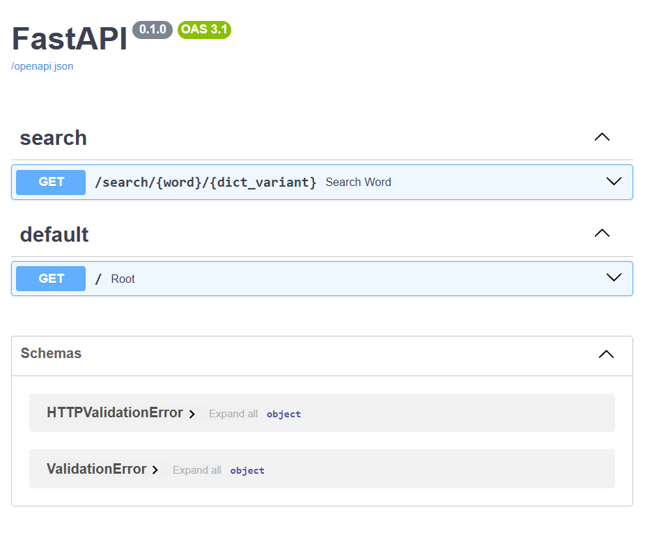

# Cambridge Api

## A simple api to get meanings of english words from cambridge dictionary for english language learnears

### Overview

This project is a Python-based program that extracts word meanings, guide words, and usage examples from the Cambridge Dictionary. Wrapped in FastAPI, it exposes the data as a JSON API. The core of the program uses requests for HTTP handling, BeautifulSoup for HTML parsing, and structured Word objects for clean data management. it was built as part of a chrome extension, another front-end project for quick access to the meanings.

_supports only mono dictionary for now..._

### How to install.

- Clone the repo:
  `git clone https://github.com/skyx20/cambridge_api.git `
- create and activate your virtual enviroment and install all the dependencies.
  `pip install -r requirements.txt`

### How to run

```bash
    fastapi dev app/main.py # for development
```

### API

If you want to know how the API works and what data it retrieves, FastAPI provide an interactive api documentation, just run the app and go to the default api docs link: `http://127.0.0.1:8000/docs`. Or look for it in the console if you have that port unavailable.
For more information on how to use the docs, see the official [FastAPI Docs](https://fastapi.tiangolo.com/tutorial/first-steps/#interactive-api-docs)

<p align="center">
  
<p>

<br>

### Json pattern

This patter comes from a Word data model, Each Word is represented as a nested object with the following structure:

```python
{
  "word": "word",
  "ipas": {},
  "audio_links": {"uk" | None : 'url', "us" | None: "url" } ,
  "origin": "origin",
  "meanings": [
    {
      "posType": "posType",
      "guideWordDefs": [
        {
          "guideWord": "guideWord" | None,
          "meanings": [
            {
              "definition": "definition",
              "cerfLevel": "cerfLevel" | None,
              "examples": [
                "Some examples"
              ]
            }
          ]
        },
      ]
    }]
}
```

Example:

```python
{
  "word": "mind",
  "ipas": {
    "uk": "maɪnd",
    "us": "maɪnd"
  },
  "audio_links": {
    "uk": "https://dictionary.cambridge.org/media/english/uk_pron/u/ukm/ukmil/ukmilli027.mp3",
    "us": "https://dictionary.cambridge.org/media/english/us_pron/m/min/mind_/mind.mp3"
  },
  "origin": "uk",
  "meanings": [
    {
      "posType": "noun",
      "guideWordDefs": [
        {
          "guideWord": "BE ANNOYED",
          "meanings": [
            {
              "definition": "(used in questions and negatives) to be annoyed or worried by something",
              "cerfLevel": "A2",
              "examples": [
                "Do you think he'd mind if I borrowed his book?",
                "I don't mind having a dog in the house so long as it's clean.",
                "I wouldn't mind (= I would like) something to eat, if that's OK",
              ]
            }
          ]
        },
      ]
    }]
}
```

### Disclaimer

The dictionary data provide by this project is sourced from a publicly available online dictionary. All data provided by this api is for non-profit personal or educational purposes and is intended for reference and learning purposes only. I do not claim ownership of the data nor do I guarantee its accuracy or completeness.

This project is not intended for commercial use, and I will not be held responsible for any infringement of commercial rights that may arise from the use of this data. Users of this project are solely responsible for their own use of the data and should ensure that they comply with all applicable laws and regulations.

### To-do:

- [x] Add support for Audio pronunciation and IPA
- [ ] Add support for translations

### Known Issues

- [ ] The api can return whatever internal exepction is raised.

### Contribute

If you want contribute to this repo, just make a new fork or open a new issue to let me know.
